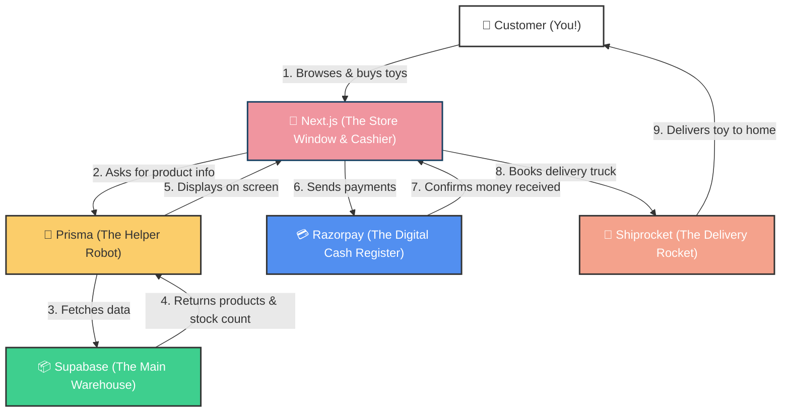

# Welcome to Kidoden 🧸✨

Have you ever wondered what happens behind the scenes of an online store? How do clothes show up on the screen, how does the money get paid, and how does the delivery truck know where to go? 

This document explains the **architecture** (the brain and bones) of Kidoden in a super simple way—like we are looking at a real physical toy shop!

---

## 🗺️ The Map of Kidoden (Architecture Diagram)

Here is a visual map showing how a customer interacts with the website and how all our digital helpers talk to each other:



---

## 👥 Meet the Team (The Tech Stack)

Just like a real shop has workers, Kidoden has a team of digital workers. Let’s meet them!

### 1. Next.js 🎨 (The Storefront & Cashier)
Think of Next.js as the **beautiful glass storefront window** and the **friendly cashier** at the front.
* It sets up the shelves, puts up the banners, and displays the catalog.
* When a customer clicks a button, it responds immediately.

### 2. Supabase 📦 (The Main Warehouse)
Think of Supabase as a **big database warehouse** in the cloud.
* It stores all our records: how many vests we have, who bought what dress, and where they want it shipped.
* It is safe, locked, and organized.

### 3. Prisma 🤖 (The Robot Helper)
Next.js speaks **TypeScript/JavaScript**, but Supabase speaks **SQL (Database Language)**. They need a translator!
* Prisma is a **friendly robot** that stands between the Storefront and the Warehouse.
* When Next.js says: *"Robot, give me all Featured Vests!"*, Prisma translates it into SQL, runs into the warehouse, grabs the data, and hands it back to Next.js in a neat package.

### 4. Razorpay 💳 (The Cash Register Ledger)
Think of Razorpay as our **secured electronic cash register**.
* It safely collects money from credit cards, UPI, or net banking, makes sure the money is real, and tells our cashier (Next.js): *"Payment successful! Go ahead and pack the toys!"*

### 5. Shiprocket 🚀 (The Delivery Rocket)
Think of Shiprocket as our **logistics fleet manager**.
* Once the order is paid, Next.js calls Shiprocket: *"We have a package ready for shipping!"*
* Shiprocket automatically prints a tracking sticker (AWB number), calls a courier, and tracks the package until it arrives at the customer's front door.

---

## 📝 The Warehouse Notebooks (Database Tables)

Inside the Supabase Warehouse, the Prisma Robot organizes data in separate notebooks called **Tables**. Here is how we describe them:

| Table Name 📖 | What it stores (Analogy) 🧸 | What is inside? 🔎 |
| :--- | :--- | :--- |
| **Category** | The store aisles (e.g. Clothing vs Gifting). | `name`, `slug` |
| **Product** | The actual items on the shelves. | `name`, `description`, `price` (stored in paise to avoid decimals!), `imageUrl`, `images`, `ageRange`, `gender` |
| **Inventory** | The stock count book at home (prevents overselling!). | `productId`, `size` (e.g. "2-3 Years"), `stockQuantity` (e.g. 5 pieces left) |
| **Customer** | The regular customer list. | `name`, `email`, `phone` |
| **Address** | The delivery address labels. | `line1`, `city`, `state`, `postalCode` |
| **Order** | The main paper receipt. | `orderNumber` (e.g. KD-1001), `totalAmount`, `status` (PENDING / CONFIRMED / SHIPPED / DELIVERED) |
| **OrderItem** | The list of items on that receipt. | `productId`, `size`, `quantity`, `price` |
| **Payment** | The ledger matching payment receipts. | `razorpayOrderId`, `razorpayPaymentId`, `amount`, `status` |
| **ShippingDetail**| The postal tracking sticker. | `shiprocketOrderId`, `awbNumber` (tracking code), `courierName` |

---

## 🔄 A Toy's Journey: How an Order is Made!

Let’s trace the journey of buying a **Mickey Vest (size 2-3 Years)**:

1. **Browsing**: You open the website. Next.js asks **Prisma Robot** to fetch products. Prisma grabs them from the **Supabase Warehouse**.
2. **Selecting a Size**: You select "2-3 Years" size. The storefront checks the **Inventory Table** to make sure the quantity is more than `0` (so you can't buy something out of stock!).
3. **Checkout**: You click "Buy". Next.js generates an order and opens the **Razorpay Cash Register**.
4. **Paying**: You enter UPI pin. Razorpay processes it, confirms to Next.js that the money is received.
5. **Deducting Stock**: The **Prisma Robot** rushes to the **Inventory Table** and reduces the stock by `1` (if we had 5 vests, now we have 4).
6. **Shipping**: Next.js sends the order to **Shiprocket** to generate a delivery slip. A courier picks it up, delivers it to your house, and you wear your cute new vest! 🎉

---

## 💳 Payment Flows: Cash on Delivery (COD) vs Online Payment (Razorpay)

Depending on how a parent wants to pay for their kids' clothes, our checkout page branches into two separate security tracks:

### Track 1: Cash on Delivery (COD) 💵
If you choose to pay when the package arrives at your home:
1. **Submit**: You fill in shipping details and select "Cash on Delivery" on `/checkout`.
2. **Stock Reservation**: The backend (`/api/checkout`) locks the items in a secure transaction and checks the **Inventory Table**. If in stock, it **decrements** the stock counts immediately to reserve the clothing for you.
3. **Database Records**: Next.js creates the Customer, Shipping Address, and Order records in the database. The Order is marked as `status: CONFIRMED` and `paymentStatus: PENDING`.
4. **Success Screen**: Next.js clears your shopping cart in the browser and redirects you directly to `/checkout/success` with your Order number.
5. **Collection**: The delivery courier collects cash at your doorstep. Upon receipt, the admin updates the order status to `DELIVERED` and payment status to `PAID`.

### Track 2: Online Payment via Razorpay 💳
If you choose to pay online via UPI, Credit/Debit cards, or Netbanking:
1. **Submit**: You fill in details and select "Online Payment" on `/checkout`.
2. **Availability Check**: The backend (`/api/checkout`) checks the **Inventory Table** to confirm stock is available, but does **not** deduct the stock counts yet (this prevents locking up stock for users who cancel or fail their transactions).
3. **Draft Order**: Next.js creates the Customer, Shipping Address, and Order records. The Order is initially marked as `status: PENDING` and `paymentStatus: PENDING`.
4. **Gateway Order**: Next.js calls the Razorpay API to generate a matching Razorpay order and returns its unique ID to your browser.
5. **Payment Popup**: The checkout page opens the secure Razorpay Checkout overlay widget. You select your payment option and authorize the purchase.
6. **Signature Verification**: Once you pay, Razorpay returns a payment signature. Next.js sends this to the verification endpoint (`/api/checkout/verify`), which calculates a secure SHA256 checksum to verify the payment is authentic.
7. **Stock Deduction & Finalization**: After verification succeeds:
   - Next.js **decrements** the stock counts in the **Inventory Table**.
   - Updates the Order status to `CONFIRMED` and paymentStatus to `PAID`.
   - Clears your cart and redirects you to the `/checkout/success` page.
   *(If the transaction fails or the popup is closed, the order is marked `CANCELLED` and stock remains untouched).*

---

## ➕ How to Add a New Product!

Adding a new toy to our shop is super easy! You have two ways to do it:

### Way 1: Direct in the Supabase Dashboard (Fastest ⚡)
You can add toys straight in your browser without changing any code:
1. **Drop the image**: Put your product picture inside the `/public/clothe/` folder of your project (for example, `new-jacket.jpeg`).
2. **Open Supabase**: Go to the **Table Editor** > **Product** table.
3. **Write the info**: Click **Insert Row** and fill in details:
   - `price`: Remember, it's stored in paise! Multiply standard Rupees by 100 (for example, enter `89900` for ₹899).
   - `categoryId`: Copy the matching Category ID from your **Category** table.
   - `imageUrl`: Set the path to `/clothe/new-jacket.jpeg`.
   - `features`: Write it as a list: `["100% Organic Wool", "Pockets included"]`.
   - Click **Save**.
4. **Set the Sizes**: Go to the **Inventory** table, click **Insert Row** for each size you offer:
   - Paste the `productId` of the product you just created.
   - Enter `size` (like `2-3 Years`).
   - Enter `stockQuantity` (how many pieces you have stored at home!).

*Now, just reload your website, and the new item will appear instantly!*

---

### Way 2: Add in Code & Re-Seed (Developer Way 🛠️)
If you want to keep your local backup files updated:
1. Open the [products.ts](file:///Users/durgaprasadhota/Developer/kidoden/src/data/products.ts) file.
2. Copy and paste an existing product block at the bottom of the list, and write your new product details.
3. Drop the product image inside the `/public/clothe/` folder.
4. Open your terminal and run:
   ```bash
   npx prisma db seed
   ```
   The Prisma Robot will automatically scan the list, find your new item, upload it to the Supabase database, and set up the starting sizes and stocks!

